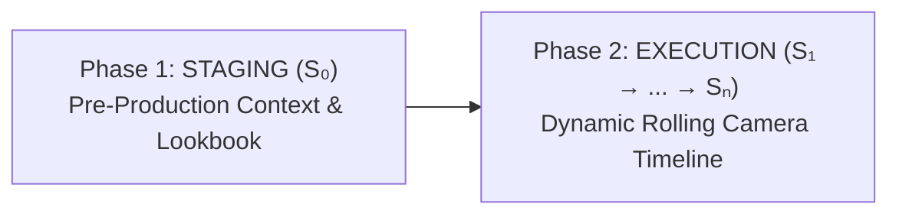

# The Auteur Script Blueprint

> **Subtitle:** From prompt guessing to cinematic state directing: a practitioner’s mental scaffold and state grammar.  
> **Author:** [Taruma Sakti](https://github.com/taruma)  
> **Original Source:** [https://auteur-script.taruma.my.id/grammar/conceptual_model.html](https://auteur-script.taruma.my.id/grammar/conceptual_model.html)  
> **Status:** Verified Foundation (✅ Audited and verified by author)

---

## The Origin

*How hands-on experimentation with reasoning models transformed prompt guessing into structured cinematic scripting.*

I didn’t come to generative video from a traditional filmmaking background. When I first started experimenting with AI video generation, I had no formal directing experience, and my editing skills were very limited. I constantly struggled with how to frame a scene, how to pace camera motion, and how to maintain spatial consistency across takes.

Like most creators, I began with the standard approach: typing single-paragraph prompts into the box and hoping the AI would guess what I saw in my mind. Sometimes the result looked interesting, but more often than not, it was a lottery. When generative models introduced advanced visual planning and multi-scene understanding (starting around early 2026 with models like *Seedance 2.0*), I realized something fundamental: **the model wasn’t failing because it lacked visual capability; it was failing because my instructions were unorganized.**

I tried adopting traditional screenplay formatting. Writing full scene headings, character descriptions, and narrative paragraphs produced richer atmospheric details, but standard screenplays brought their own friction:

1. **Screenplays hide camera mechanics**: Traditional screenplays deliberately avoid shot lists, lens choices, and micro-choreography to leave room for the human film crew. But generative video models *are* the crew—they need clear optical and physical coordinates.
2. **The character limit wall**: During a paid client collaboration, I was asked to deliver high-control prompts that fit within strict platform character limits. Verbose screenplay prose wasted hundreds of characters setting up the room, leaving almost no token budget for the actual action beats.

I had to find a way to cram my full directorial intent into a lean, readable, high-precision format that leveraged the model’s visual planning to fill in the gaps without sacrificing creative control. I started calling this compact format **“Auteur Brief.”**

During a discussion around that time, a friend shared an eye-opening perspective with me in a late-night conversation: *“A script isn’t just a description—it’s a set of instructions designed to trigger an experience.”*

---

<!-- ======================================================= -->
<!-- MEDIA: Figure 1 (Image: Quote Script Experience)        -->
<!-- ======================================================= -->
> 🖼️ **Image Placeholder: Quote Script Experience**  
> **Original Asset URL:** `https://auteur-script.taruma.my.id/grammar/_assets/quote_script_experience.jpg`  
> **Caption:** *Figure 1: A script isn’t just a description — it’s a set of instructions designed to trigger an experience.*  
> **Alt Text:** *Archival vintage photograph of a solitary silhouette tree on a hillside under moody skies with the quote: 'a script isn't just a description — it's a set of instructions designed to trigger an experience. — a friend, in a late-night conversation'*  
> **Description:** Archival monochrome/sepia-toned fine art photograph showing the dramatic dark silhouette of a lone windswept tree standing atop a barren hillside beneath turbulent, overcast skies. The quiet, contemplative composition is paired with the philosophical text: *"a script isn't just a description — it's a set of instructions designed to trigger an experience. — a friend, in a late-night conversation"*.

---

That realization changed everything. I realized that “Auteur Brief” wasn’t just a clever prompt hack; it was an actual script. It had clear structural rules—governing world setup in Staging and sequential beats in Execution—that stopped trying to force absolute pixel-by-pixel micro-control over the AI. Instead, the model became like a skilled film crew: we provide the structural coordinates and the creative destination, and the model’s visual planning engine figures out the natural physical momentum and gap-filling on its own.

From that point on, I stopped calling these inputs “prompts.” I called them **scripts**—and eventually, the **Auteur Script**. It is simply my personal framework for structured prompting: a systematic way to organize creative intent, establish physical boundaries, and guide generative video models without micromanaging every pixel. While the broader AI industry was trying to move away from prompting toward black-box generation, I moved in the opposite direction: **I wanted a script format that I could understand, learn from, evaluate outputs against, and use to build my own creative intuition as a director.**

---

## Staging Architecture

*Organizing creative vision into three fundamental pillars and two distinct production phases.*

To direct a scene with clarity, Auteur Script organizes creative intent across three fundamental pillars. These pillars separate the conceptual purpose, the physical environment, and the temporal progression into distinct cognitive layers:

| Pillar | Focus | Directorial Role |
|---|---|---|
| **Pillar 1: INTENT** | The “Why” & Vision | The core thematic stakes, emotional core, dramatic objective, and invariant boundary constraints governing the scene. |
| **Pillar 2: AESTHETIC** | The Audio-Visual World | The lookbook defining color palette, lighting ratios, wardrobe, environment, acoustics, and the starting frame anchor ($S_0$). |
| **Pillar 3: EXECUTION** | The Dynamic Timeline | The play-by-play narrative timeline sequencing how camera, performance, and sound mutate across screen time. |

These three pillars form a natural cognitive hierarchy, but they do not force a rigid writing sequence. On some days, I start with Execution first—writing dialogue beats and physical choreography when the kinetic rhythm is fresh in my mind. On other days, I begin with Aesthetic and Intent—locking down a 1970s tropical noir lookbook before deciding what happens in the room.

### The Two Production Phases

To translate these pillars into a clean, reproducible prompt blueprint, Auteur Script partitions the scene into two distinct production phases:



This two-phase workflow mirrors how real filmmaking operates: you dress the set, prop the actors, and dial in the lighting long before calling *“Action!”*:

- **Phase 1: STAGING (Pre-Production Setup)**: Establishes the static world, physical invariants, and initial canvas before motion begins:
  - **`[INTENT]`**: The core dramatic goal, format, and emotional stakes.
  - **`[LOGIC]` (The Invariant Anchor)**: Diegetic physical rules, spatial permanence, and boundary constraints. Because execution lines are written punchy and brief, `[LOGIC]` acts as a reasoning-layer guardrail that guides the model’s visual planning and primes upstream token prediction, preventing lazy shortcuts or impossible geometry.
  - **`[AESTHETIC]`**: Structured lookbook defining palette, lighting ratios, wardrobe, environment, and acoustics.
  - **`[OPENING]` ($S_0$)**: The composed starting still canvas ($t = 0$), establishing camera framing and subject coordinates before motion begins.
- **Phase 2: EXECUTION (Active Rolling Camera)**: Directs the dynamic timeline beat by beat:
  - **`[EXECUTION]`**: The active timeline container where camera, actors, props, and audio mutate sequentially across time ($S_1 \mapsto \dots \mapsto S_n$). Details locked in `[AESTHETIC]` are never redundantly restated.

---

## Mapping the Motion

*Formalizing scene progression through state vectors, recursive equations, and programming pipelines.*

When I tried to figure out how to direct complex motion without writing endless paragraphs, I looked outside filmmaking to mathematics and programming.

In programming, we pipe data (`|>` in R), taking the output of “State A” and passing it through a function to get “State B”:

$$x \mapsto f(x)$$

I had a lightbulb moment: *Why can’t we treat a film scene the exact same way?*

I sometimes worry that this sounds like I’m trying to over-intellectualize a simple concept. But the reality is much simpler: this is quite literally how my brain processes and visualizes a scene. I see a series of state changes, variables shifting, and values mapping forward in real time.

I don’t write these mathematical expressions as formal academic proofs or claims about neural network internals. I write them because mathematics and state vectors are the cleanest, most compact thinking notation I have found to turn creative intuition into trackable coordinates. It is simply my personal visual shorthand for turning creative chaos into an organized blueprint.

### The State Vector Formulation

In Auteur Script, we treat the complete screen state at any moment as a **Macro-State vector** ($S_n$):

$$S_n = \langle s_{\text{camera}}, s_{\text{action}}, s_{\text{audio}}, \dots \rangle$$

Where camera optics, character performance, and sound design form the Core Triad of baseline coordinates, and the ellipsis ($\dots$) allows the vector to be extended to any custom dimension (such as `[LIGHT]`, `[FOCUS]`, or `[PROP]`).

### The Core Staging Equation

The progression of an entire cinematic scene is modeled as a sequence of state transformations:

$$S_0 \mapsto S_1 \mapsto S_2 \mapsto \dots \mapsto S_n$$

Where each dynamic transformation $f$ mutates the screen state across a narrative beat ($\Delta t$), conditioned directly upon the pre-production Staging setup:

$$S_n = f(S_{n-1} \mid \text{STAGING})$$

$$\text{STAGING} = \langle \text{INTENT}, \text{LOGIC}, \text{AESTHETIC}, S_0 \rangle$$

- **$S_0$**: The initial visual anchor locked in `[OPENING]` ($t = 0$).
- **$S_{n-1}$**: The accumulated physical state immediately preceding the current beat.
- **$\text{STAGING}$**: The global invariant baseline (thematic intent, physical logic, and lookbook) conditioning all mutations.
- **$f$**: The directional mutation operator commanding the beat’s transition across duration $\Delta t$.
- **$S_n$**: The resulting screen state at the conclusion of the beat.

Sometimes, the best way to paint a picture is to write a little math.

### Decomposing the Timeline: Macro-States & Sub-States

To see how this structural math translates into real scriptwriting and video generation, consider *What Remains*—a production scene rendered with Seedance 2.0. In this scene, an emotional confrontation between an estranged father and son unfolds through unbroken spatial continuity and prop tracking:

- **Model:** Seedance 2.0 (1080p)

<!-- ======================================================= -->
<!-- MEDIA: Video 1 (What Remains Drama Sequence)           -->
<!-- ======================================================= -->
> 🎬 **Video Placeholder: What Remains (Production Scene)**  
> **Direct Video Source URL:** `https://videos.files.wordpress.com/CTomf6sR/sh009.mp4`  
> **Description:** Neorealist indie drama scene rendered in 1080p with Seedance 2.0. Depicts an emotional confrontation in a dusty, half-packed suburban living room between John (estranged son clutching a heavy cardboard box of vinyl records) and Robert (weathered aging father). Highlights spatial continuity, prop weight tracking, shot-reverse-shot eyeline alignment, and the tragic moment where Robert's pointing fury abruptly collapses into vacant Alzheimer's-like confusion as his arm freezes mid-air.

#### Full Auteur Script Blueprint: What Remains

```text
[INTENT]
Create a neorealist indie drama scene featuring @ROB as Robert (an aging, weathered father) and @JOHN as John (his intense, estranged son).

[LOGIC]
Maintain spatial continuity in a dusty, half-packed room. Keep prop tracking consistent with a cardboard box of vinyl records. Trace Robert's transition from anger to vacant confusion.

[AESTHETIC]
Medium: 35mm film, naturalistic grain
Palette: Desaturated amber, dusty ochres, soft shadows
Lighting: Direct golden afternoon light casting long window-pane shadows
Location: Cluttered, mid-century suburban living room with stacked moving boxes
Hair/Makeup: Robert (disheveled curly grey hair, weathered skin); John (messy shoulder-length dirty-blond hair, sweat-sheen)
Wardrobe: Robert wearing faded olive knit polo; John wearing dusty dark-grey denim shirt over a white tee
Audio: Diegetic only. Cardboard scraping, heavy breathing, floorboard creaks, distant cicadas

[OPENING]
MS, handheld, facing John standing frame-left, clutching a cardboard box of vinyl records tightly against his chest, glaring off-frame right at Robert near a sunlit window.

[EXECUTION]
[CAM] MS, handheld, drift-left -> [ACT] John grips the box, knuckles white -> John: "We can't keep everything, Dad. Just pick." -> [AUDIO] Cardboard scraping.
[CAM] MCU, low-angle on Robert near window -> [ACT] Robert points an accusatory finger, chest heaving -> Robert: "That's my life in those boxes!" -> [AUDIO] Cicadas buzzing.
[CAM] OTS behind Robert looking at John -> [ACT] John steps closer, jaw tight with resentment -> John: "You didn't care about this house for ten years!" -> [AUDIO] Heavy breathing.
[CAM] CU, tracking Robert -> [ACT] Robert opens his mouth to yell, but freezes. His pointing hand stays suspended, his angry gaze suddenly shifting to a hollow, terrifying blankness -> [AUDIO] Floorboard creak.
[CAM] INS, close-up on the box -> [ACT] John's grip on the cardboard box loosens, a vinyl sleeve sliding outward slightly -> [AUDIO] Paper rustling.
[CAM] MCU, OTS behind Robert's frozen shoulder -> [ACT] John's anger instantly drains, replaced by suffocating shock, his lips parting -> John: "Dad...?" -> [AUDIO] Sudden dead silence.
[CAM] CU on Robert -> [ACT] Robert's hand slowly drops to his side. He blinks rapidly, looking around the room as if seeing it for the first time -> Robert: "Where... where is your mother?" -> [AUDIO] Clock ticking faintly.
[CAM] MS, profile tracking -> [ACT] John slowly, silently lowers the heavy box onto a wooden table frame-left, keeping his eyes locked on his father -> John: "She's not here, Dad." -> [AUDIO] Dull thud of cardboard on wood.
[CAM] WS, extreme low-angle -> [ACT] Thick dust motes drift lazily through a bright shaft of sunlight cutting between the two men -> [AUDIO] Distant wind.
[CAM] MCU, slow push-in on John -> [ACT] John's eyes well with tears. He swallows hard, staring at his father's vacant silhouette in the foreground -> [AUDIO] Shaky sigh, silence.
```

By structuring the scene with this separation, the lookbook, environment, and physical rules are established upfront in Staging. When the camera begins rolling in `[EXECUTION]`, the prompt directs the emotional shift beat by beat. When Robert’s accusatory anger abruptly collapses into vacant confusion, the model preserves the spatial geography of the room and the physical anchor of the cardboard box across every cut.

The timeline operates on two grammatical levels:

1. **The Macro-State ($S_n$) — The Human Pre-Visualization Unit**: A single complete line in `[EXECUTION]` represents one Macro-State ($S_n$). The primary purpose of dividing a scene into one-line beats is **cognitive pacing**. As you read each line, your mind naturally plays that moment—where the camera moves, how the actors shift, and what sound anchors the contact. Breaking actions across lines prevents dense walls of text and lets your eyes scan, evaluate, and verify the scene’s physical continuity before spending compute credits.
2. **The Sub-State ($s_i$) & The Chaining Operator (`->`)**: Within a single line, action is sequenced into atomic Sub-States chained with `->`:

$$S_1 = \langle \text{[TAG}_1\text{] } s_1 \mapsto \text{[TAG}_2\text{] } s_2 \mapsto \dots \mapsto \text{[TAG}_k\text{] } s_k \rangle$$

Each bracketed tag ($\tau \in \mathcal{T}$) modifies strictly **one isolated physical or optical dimension**:

$$\mathcal{T} = \{\text{CAM}, \text{ACT}, \text{DIAL}, \text{AUDIO}, \text{BLOCK}, \text{AXIS}, \text{FOCUS}, \text{LIGHT}, \text{PROP}, \dots\}$$

The chaining operator (`->`) serves a deliberate dual role across the framework:

- **Across Macro-State lines**: `->` denotes **sequential temporal beats** progressing across screen time ($S_0 \to S_1 \to S_2$).
- **Within a single execution line**: `->` acts as a **hierarchical layering operator**. It establishes the camera perspective first, grounds the actor’s physical performance within that optical frame, delivers dialogue, and anchors physical contact with diegetic audio. Rather than disjoint chronological steps, these layers resolve into a single, synchronized beat interval ($\Delta t$).

Sub-State tags are, strictly speaking, optional for the machine. Advanced video models operate on token attention and can infer categories without square brackets:

$$\text{[CAM] MCU, low-angle on Robert} \equiv \text{MCU, low-angle on Robert}$$

**Tags are a cognitive tool for the human director.** When you type `[CAM]`, `[ACT]`, or `[AUDIO]`, it forces you to separate your creative thinking—to think like a cinematographer first, then a choreographer, then a sound designer. Once you have finished pre-visualizing your scene, you can freely strip these tags if you need to save character space in a prompt box.

---

## Directing the Frame

*Setting structural boundaries, maintaining physical continuity, and cultivating creative intuition.*

Understanding the notation is only half the battle. The true craft of directing generative video lies in how we manage the relationship between our instructions and the model’s visual planning capabilities.

### Establishing Fences for Latent Priors

In my early experiments, I often tried to micromanage every second of screen time—specifying that at two seconds the actor turns, at four seconds the camera pans, and at six seconds a tear falls. When you squeeze generative models with rigid temporal timestamps, the motion tends to stutter and look artificial. Generative video models are not deterministic animation software; they are high-dimensional probability engines that have absorbed deep physical, anatomical, and temporal latent priors from millions of hours of real footage.

The Auteur Script works by establishing structural boundaries, not rigid handcuffs. We tell the model where the shot begins ($S_{n-1}$), which specific variable is changing ($\tau \in \mathcal{T}$), and the destination state it must reach ($S_n$). By locking these coordinate fences, we collapse latent ambiguity. Once those boundaries are set, we step back and allow the model’s learned physical priors to interpolate natural momentum, gravity, weight, and micro-acting nuances to fill in the gaps smoothly.

### State Inheritance and Physical Baggage

In physical filmmaking, continuity is maintained by script supervisors who track costume conditions, prop placements, and actor positions across takes. In Auteur Script, this continuity is governed by state inheritance ($S_n = f(S_{n-1})$). Every Macro-State line automatically carries forward the accumulated physical reality of the previous line—what I think of as the scene’s “physical baggage.”

If a character picks up a heavy cardboard box in Line 1, that box does not magically vanish in Line 2 when the camera cuts to a close-up of their face. Their arms remain occupied, their posture stays strained, and the prop remains physically anchored in the scene geography until an explicit action releases it.

However, because current generative models operate on token attention rather than persistent physical simulation, creators must apply the **Repetition Mandate** for continuity-critical details. When an action hinges on a specific physical condition—such as which hand holds a prop or whether a character is seated—explicitly carrying forward and restating that detail across beats reinforces the conditioning across the sequence. More importantly, it acts as an explicit checklist for the human director to verify continuity before dispatching compute.

### Camera Persistence Across Action Beats

Under camera persistence, a new line in an Auteur Script does not inherently indicate a camera cut. To direct subtle performances without triggering unwanted perspective shifts, we use numbered camera identifiers such as `[CAM 01]`.

When `[CAM 01]` appears on consecutive lines, it instructs the model to hold the existing lens framing and spatial perspective across micro-actions, eyeline shifts, or lines of dialogue. This allows the human director to pace out complex, multi-beat performances into clean, readable lines while preserving unbroken camera continuity.

### The Dual Role: Pre-Visualization and Diagnostic Debugging

The structured architecture of Auteur Script serves two complementary functions across the creative production lifecycle:

| Track | Stage | Production Focus | Key Benefit |
|---|---|---|---|
| **Forward Track** | **Pre-Visualization Scaffold** *(Mental Staging Before Generation)* | Rehearse blocking, optical framing, and acoustics; structure intent into static Staging ($S_0$) and kinetic Execution beats ($S_1 \dots S_n$). | Catches continuity contradictions and missing constraints before spending compute credits. |
| **Feedback Track** | **Diagnostic Post-Mortem** *(Root-Cause Debugger After Generation)* | Evaluate rendered motion, character eyelines, and physical object tracking; systematically isolate root cause between Staging setup vs. Execution timeline. | Isolates whether discrepancies stem from prompt ambiguity or stochastic AI variance. |

This dual workflow transforms prompting from an unpredictable lottery into a structured learning and evaluation discipline:

1. **Prior to generation (Pre-Visualization Scaffold)**: By forcing yourself to define the initial anchor ($S_0$), the physical lookbook in Staging, and the causal transitions in Execution, you mentally rehearse the entire scene before clicking generate. This cognitive clarity eliminates continuity contradictions and ambiguous instructions before rendering.
2. **After generation (Diagnostic Debugger)**: When a generated clip diverges from what you intended, the modular structure allows you to isolate the root cause systematically:
   - Did the opening frame fail because `[OPENING]` lacked specific character coordinates?
   - Did a character drift or drop an object because `[LOGIC]` missed a persistent physical invariant?
   - Did the camera whip unexpectedly because an `[EXECUTION]` line combined conflicting camera moves?

By maintaining an explicit state ledger, you can immediately tell whether an output failed because of an ambiguous human instruction or because of stochastic latent variance. This feedback loop is what trains your eye and builds genuine directorial intuition over time.

### Cultivating Directorial Intention

Generative AI models and platform interfaces will continue to evolve rapidly. Delimiters, prompt box limits, and tokenizer architectures will shift with every model generation. But while technology upgrades overnight, human creative intuition, visual taste, and directorial intention do not.

Auteur Script is not built around hacking temporary model quirks. It is built as a learning framework to help human creators clarify their own vision, understand the mechanics of cinematic staging, and cultivate the enduring craft of visual storytelling.

This framework isn’t the result of an academic laboratory study, and I haven’t run formal algorithmic benchmarks on attention weights. For all I know, my successful generations could just be pure luck! But ever since the release of reasoning-capable video models, this state-driven approach is what I use every single day, and it has consistently delivered results in my own workflow.

I am not here to prescribe a rigid dogma or force my personal habits onto you. I’m simply laying out these foundational concepts so you can test them in your own creative sandbox. If this framework resonates and works for your projects, that’s wonderful. If it doesn’t, my hope is that it still sparks useful insights about how you visualize scenes, how you interact with AI models, and how your own creative process works.

---

## Reading Roadmap

*Consult the master dictionary and explore block specifications to continue building your workflow.*

> [!NOTE]
> **Master Framework Dictionary**  
> Explore the complete, categorized reference guide to all framework terminology in the dedicated **[Master Glossary](https://auteur-script.taruma.my.id/grammar/glossary.html)**.

To see how the 5 Macro-Blocks enforce orthogonality and prevent prompt bloat, proceed to **[Block Grammar & Orthogonality](https://auteur-script.taruma.my.id/grammar/block_rules.html)**.
