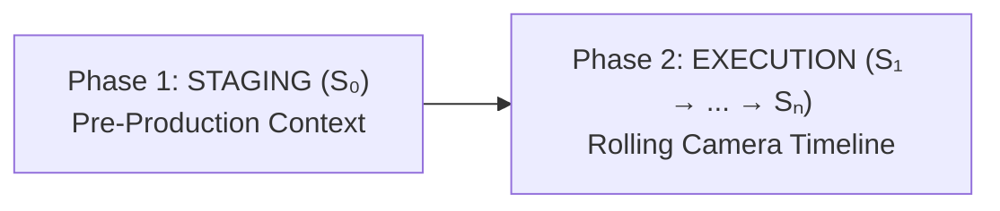

# Auteur Script

> **Subtitle:** A human-centric cinematic prompt specification & directorial pre-visualization framework for AI filmmaking.  
> **Author:** [Taruma Sakti](https://github.com/taruma)  
> **Version:** [v0.3.0](https://auteur-script.taruma.my.id/CHANGELOG.html)  
> **Status:** Open Research Notes  
> **Original Source:** [https://auteur-script.taruma.my.id/](https://auteur-script.taruma.my.id/)

---

> *“Control is an illusion; intent is everything.”*  
> — Taruma Sakti

When modern video models advanced beyond simple keyword associations to leverage deep visual and temporal priors, something fundamental shifted: prompting stopped being about fighting for pixel-level control and became a collaborative process. We provide the structural blueprint, intent, and physical coordinates; the model draws upon its learned physical priors to calculate the latent rendering.

**Auteur Script** is an open prompt framework and cognitive pre-visualization scaffold born from that realization. It gives creators a practical way to mentally rehearse, stage, and evaluate a scene before spending compute—translating creative vision into a clean, platform-agnostic blueprint that collapses latent ambiguity and guides the model along a coherent cinematic path.

> [!WARNING]
> **Early Development & Active Experimentation**  
> This specification is in **very early, experimental development**. As generative video models evolve and new techniques are discovered through continuous trial and error, concepts, tag specifications, and examples are actively shifting and being refined.
> 
> Additionally, this project was originally authored as an internal AI agent skill before being transitioned into an open knowledge base. During this ongoing refactoring, you may encounter formatting structures or phrasing across some documents that reflect their agent-skill origins rather than a standard documentation site.
> 
> To follow real-time updates, production experiments, and insights—or to ask questions and share feedback—connect with me on X: [**@tarumainfo**](https://x.com/tarumainfo).

---

## Directorial Grammar & Workflow

In early experiments with generative video, creators often hit two walls: paragraph prompts that drift into chaotic motion, and strict character limits that leave no room for real action after describing the room.

To solve this, Auteur Script treats a film scene like a physical production and a computational state pipeline: **stage the world first, then direct the action beat by beat.**



This two-phase separation mirrors how real sets operate. You establish the invariant context of the scene up front, and then spend your creative energy strictly on directing movement, performance, and sound.

### 1. Stage the World Before Calling Action

In traditional filmmaking, you don’t rebuild the set or redesign the wardrobe between every shot. You lock the environment, lighting, and character appearance in pre-production.

Auteur Script separates static setup from active shooting:

> [!NOTE]
> **Phase 1: STAGING (Pre-Production Setup)**  
> *Establish world context, physical invariants, and the opening frame ($S_0$) before motion begins.*
> - **`[INTENT]`**: The core dramatic goal, stakes, and narrative tone.
> - **`[LOGIC]`**: Hard physical guardrails, screen direction, and continuity rules.
> - **`[AESTHETIC]`**: Film stock, color palette, lighting scheme, location lookbook, and acoustic profile.
> - **`[OPENING]`**: The starting still canvas ($t = 0, S_0$) establishing camera framing and subject coordinates.

> [!TIP]
> **Phase 2: EXECUTION (Active Rolling Camera)**  
> *Call action and direct the kinetic timeline beat by beat ($S_1 \dots S_n$).*
> - **`[EXECUTION]`**: Sequential Macro-State lines chaining atomic, single-dimension coordinates: `[CAM Optics]` $\to$ `[ACT Performance]` $\to$ `[AUDIO Sound]`
> - **Causal State Flow**: Motion progresses through narrative beats ($S_0 \to S_1 \to S_2$) rather than rigid artificial timestamps.

By anchoring the world lookbook and initial camera framing in pre-production, your active execution timeline remains uncluttered. You direct physical choreography beat by beat without ever needing to re-describe the room.

### 2. How the Framework Operates in Practice

This workflow rests on three foundational principles that reflect how a director mentally stages and visualizes a scene:

1. **Cognitive Pre-Visualization (Scaffold First)**: When reading an Auteur Script, each Macro-State line ($S_n$) represents an unbroken moment of screen time. If you can mentally simulate where the camera sits, how the actor moves, and what sounds occur, you eliminate descriptive ambiguity before spending compute credits.
2. **Single-Dimension Orthogonality**: Each coordinate tag governs strictly one isolated physical or optical dimension. Camera optics (`[CAM]`) never describe actor emotion; character performance (`[ACT]`) never dictates lighting; spoken dialogue (`[DIAL]`) never mixes with foley sound (`[AUDIO]`). Isolating these dimensions prevents cross-attention vector collisions between camera motion and character anatomy.
3. **The State Carryover Ledger (Physical Baggage)**: A scene unfolds as a continuous state transition ($S_n = f(S_{n-1} \mid \text{STAGING})$). Rather than machine code for a CPU, this equation serves as the creator’s mental state ledger: every beat carries forward the preceding camera framing, character posture, and held props unless explicitly transitioned, providing an objective checklist to evaluate outputs.

When you structure a scene with these clear boundaries, your script becomes an executable cognitive rehearsal. The generative model no longer has to guess where subjects start or what the lighting looks like—your coordinates collapse latent uncertainty, allowing the model’s learned physics to fill in natural momentum smoothly.

---

## See It In Action (Video & Script Showcase)

To see how these concepts translate into real video generation, here are production scenes created with Dreamina across Seedance 2.0 and Seedance 2.5 models.

### Exhibit 1: Prehistoric Survival Chase

*Demonstrates multi-character spatial tracking and environmental destruction in a high-speed chase sequence.*

- **Model:** Seedance 2.5
- **Generator Platform:** [Dreamina Generation Link](https://dreamina.capcut.com/sv2/ZSVcBGytx/)

<!-- ======================================================= -->
<!-- MEDIA: Video 1 (Prehistoric Survival Chase)             -->
<!-- ======================================================= -->
> 🎬 **Video Placeholder: Prehistoric Survival Chase**  
> **Direct Video Source URL:** `https://videos.files.wordpress.com/O4jjenjG/dreamina-2026-08-14-3438.mp4`  
> **Description:** High-octane prehistoric chase sequence rendered in Seedance 2.5. Demonstrates multi-character tracking, screen direction adherence (strict left-to-right), heavy environmental destruction (splintering ferns, mossy roots, tumbling logs), and close pursuit by raptor-like feathered predators across rough terrain and a shallow stream toward a dark cave entrance.

#### Full Auteur Script Blueprint: Prehistoric Survival Chase

```text
[INTENT]
Create a high-octane prehistoric survival chase sequence featuring @image1 as Robert, @image2 as Samira, and @image3 as Arthur sprinting for their lives through a dense primeval jungle pursued by relentless prehistoric predators.

[LOGIC]
Maintain strict left-to-right screen direction across all tracking setups. Preserve spatial order with Robert leading, Samira centered, and Arthur trailing in rear position. Ensure continuous physical environmental destruction from pursuers while keeping distressed wardrobe and mud-splatter continuity persistent across shots.

[AESTHETIC]
Medium: 35mm cinematic film, grounded realism, gritty naturalism.
Palette: Deep olive foliage, dark volcanic soil, misty slate, muted warm highlights.
Lighting: Dappled canopy sunlight, high-contrast jungle shadows, atmospheric mist shafts.
World: Primeval jungle with towering scale-bark conifers, colossal ferns, dense root networks, and shattered ancient trunks.
Creature: Agile feathered bipedal hunter with serrated head-crest -> DIN01, broad-winged leathery glider with narrow predatory beak -> DIN02, pack of three low-slung quadrupedal scavengers -> DIN03
Wardrobe: Robert in distressed tactical vest and sweatband; Samira in dirt-streaked utility tunic and leather head-strap; Arthur in torn heavy oilskin jacket.
Audio: Humid atmospheric wind, foliage ripping, heavy footfalls in damp loam, predator bellows.

[OPENING]
[CAM 01] FS, TRACKING. Primeval jungle corridor of giant ferns and mossy roots. Arthur sprints in rear position frame-left, Samira pushes forward in midground center, and Robert leads at frame-right, all moving at full speed toward screen-right as foliage shatters behind them.

[EXECUTION]
[CAM 01] FS TRACKING -> [BLOCK] Arthur frame-left, Samira center, Robert frame-right -> [STATE IN] Trio in full lateral sprint -> [ACT] Robert hurdles a fallen log while Samira navigates around giant ferns -> Robert says (gasping) {-keep pushing, don't look back!-} -> <Violent branch snapping> -> [STATE OUT] Robert clears log, Arthur pushes behind.
[CAM 02] MS FRONTAL TRACKING -> [BLOCK] Robert foreground, Samira midground, Arthur background -> [STATE IN] Robert leading sprint directly forward -> [ACT] Robert checks behind his shoulder while pumping arms -> Samira says (panting) {-they're right behind us!-} -> <Heavy bipedal footfalls crunching damp moss> -> [STATE OUT] Robert faces forward, accelerating.
[CAM 04] MS HANDHELD TRACKING -> [BLOCK] Samira center-right, Robert far-right, foliage whipping past frame-left -> [STATE IN] Rapid turbulent lateral sprint -> [ACT] DIN01 crashes through background tree ferns, snapping jaws near Arthur -> <Splintering wood and guttural screech> -> [STATE OUT] DIN01 lunging through shattered brush.
[CAM 03] FS REAR TRACKING -> [BLOCK] Arthur foreground, Samira midground, Robert distant background -> [STATE IN] Chasing trio from behind down narrow corridor -> [ACT] Arthur shoulders through snapping bamboo stalks and glances upward -> Arthur says (straining) {-heads up, above us!-} -> <Heavy wing beats overhead> -> [STATE OUT] Upper canopy foliage shaking violently.
[CAM 02] MCU FRONTAL TRACKING -> [BLOCK] Samira foreground left, Robert foreground right, Arthur visible behind -> [STATE IN] Trio running head-on into camera -> [ACT] Samira ducks low as a large shadow sweeps across her face -> Arthur says O.S. (yelling) {-duck down!-} -> <Piercing aerial shriek> -> [STATE OUT] Samira recovering running posture.
[CAM 01] MS TRACKING -> [BLOCK] Arthur frame-left, Samira center, Robert frame-right -> [STATE IN] Lateral sprint across open moss bank -> [ACT] DIN02 swoops low through tree gap, raking talons across branch above Samira -> <Air displacement and foliage tearing> -> [STATE OUT] DIN02 banking hard upward into canopy.
[CAM 04] MS HANDHELD TRACKING -> [BLOCK] Arthur foreground left, stumbling slightly, Samira midground -> [STATE IN] Rough uneven terrain sprint -> [ACT] Arthur regains stride, churning through thick mud -> Arthur says (wheezing) {-I can't outrun these things!-} -> <Wet mud squelching and rapid scuttling> -> [STATE OUT] Arthur matching group cadence.
[CAM 02] FS FRONTAL TRACKING -> [BLOCK] Robert foreground, Samira midground, Arthur background -> [STATE IN] Linear dash toward camera -> [ACT] Pack of DIN03 bursts from underbrush flanking Arthur's boots -> <Aggressive hissing and rustling dry leaves> -> [STATE OUT] DIN03 snapping at trailing heels.
[CAM 01] FS TRACKING -> [BLOCK] Arthur frame-left kicking outward, Samira center, Robert frame-right -> [STATE IN] Fast lateral retreat -> [ACT] Arthur kicks out his boot at approaching DIN03 while maintaining forward motion -> Robert says O.S. (shouting) {-into the ravine path!-} -> <Jaws snapping on empty air> -> [STATE OUT] DIN03 scattering momentarily.
[CAM 03] MS REAR TRACKING -> [BLOCK] Arthur foreground, Samira midground, Robert leading ahead -> [STATE IN] Approaching narrow tree cleft -> [ACT] Robert directs group between two colossal mossy trunks -> Robert says (grunting) {-squeeze through, now!-} -> <Heavy impact against tree base> -> [STATE OUT] Robert slipping through narrow gap.
[CAM 04] MCU HANDHELD TRACKING -> [BLOCK] Samira center, Robert exiting frame-right -> [STATE IN] Squeezing past splintered bark -> [ACT] Samira throws a wide-eyed glance backward while gasping -> Samira says (gasping) {-it's too close!-} -> <Deafening predatory roar> -> [STATE OUT] Samira pushing hard through opening.
[CAM 01] MS TRACKING -> [BLOCK] Arthur frame-left, Samira center, Robert frame-right descending slope -> [STATE IN] Downhill momentum -> [ACT] DIN01 smashes through the narrow timber gap behind Arthur -> <Massive wood fracture and falling debris> -> [STATE OUT] Timber fragments showering behind Arthur.
[CAM 02] FS FRONTAL TRACKING -> [BLOCK] Robert foreground, Samira midground, Arthur background -> [STATE IN] Plunging down muddy slope -> [ACT] Trio slides down slick gradient, churning loose soil forward -> Arthur says (screaming) {-keep going!-} -> <Wet earth sliding and roaring breath> -> [STATE OUT] Trio reaching base of slope.
[CAM 03] FS REAR TRACKING -> [BLOCK] Arthur foreground, Samira midground, Robert background sprinting -> [STATE IN] Wet rocky creek bed sprint -> [ACT] DIN02 dives from upper mist while DIN01 leaps down slope in pursuit -> <Distant bellows and rushing wind> -> [STATE OUT] Predators rapidly closing distance behind trio.
[CAM 01] FS TRACKING -> [BLOCK] Arthur frame-left, Samira center, Robert frame-right sprinting screen-right -> [STATE IN] High-speed lateral splash through shallow stream -> [ACT] Robert leads Samira and Arthur through spraying water toward a dark cavern opening -> <Violent water splashing and echoed snarls> -> [STATE OUT] Trio surging past camera toward cave entrance.
```

> **Directorial Insight:** Notice how the script locks the dense primeval jungle and character wardrobe once in `[AESTHETIC]`, leaving each `[EXECUTION]` line free to drive fast-paced camera tracking, actor hurdles, and creature pursuit without losing visual continuity.

---

### Exhibit 2: Continuous POV War Survival

*Demonstrates continuous camera persistence and first-person intimacy in an unbroken single-take sequence.*

- **Model:** Seedance 2.5
- **Generator Platform:** [Dreamina Generation Link](https://dreamina.capcut.com/sv2/ZSVcD4TPW/)

<!-- ======================================================= -->
<!-- MEDIA: Video 2 (Continuous POV War Survival)           -->
<!-- ======================================================= -->
> 🎬 **Video Placeholder: Continuous POV War Survival**  
> **Direct Video Source URL:** `https://videos.files.wordpress.com/aEMlRCTD/dreamina-2026-08-17-1599.mp4`  
> **Description:** Unbroken 18-beat first-person POV shot from a child's eye-level perspective during a war bombardment. Features Robert (a determined father) leaning close over the lens, helping the child to their feet, crouching under fallen rebar, sprinting through a smoke-filled hallway, diving across the camera to shield against a violent explosion shockwave, and guiding the child down into a dark basement stairwell without a single camera cut.

#### Full Auteur Script Blueprint: Continuous POV War Survival

```text
[INTENT]
Create a continuous-take first-person POV war-survival scene following @actor1 as Robert, a determined father guiding a child through a collapsing, dust-choked apartment building under heavy bombardment.

[LOGIC]
Maintain an unbroken first-person child eye-level perspective across all 18 beats without cuts. Ensure strict spatial continuity relative to Robert's position, preserving consistent destruction, drifting dust, and directional exterior lighting.

[AESTHETIC]
Medium: Cinematic 35mm film, visceral handheld texture, shallow depth of field.
Palette: Desaturated concrete greys, soot black, cold blue shadows pierced by warm blast flashes.
Lighting: Chiaroscuro key light through breached walls with intermittent muzzle strobing.
Location: Ruined high-rise interior with pulverized drywall, hanging rebar, and shattered concrete.
Wardrobe: Robert wearing a weathered charcoal canvas field jacket over a torn olive-drab Henley; Child wearing a dirt-streaked oversized navy wool knit sweater.
Sound: Diegetic only with concussive bass rumbles, muffled distant gunfire, crunching debris, and labored breathing.

[OPENING]
ECU at low floor level, black vignette opening slightly to reveal Robert's soot-streaked face leaning close over the lens, illuminated by flickering ambient fire through cracked concrete.

[EXECUTION]
[CAM] ECU, handheld low tilt up -> [ACT] Blurry black vignette blinks open revealing Robert's face inches from the lens -> Robert says (whispering) {Hey... wake up.} -> <Muffled high-pitch tinnitus tone> -> [ACT] Robert places a steadying hand beside the lens frame.
[CAM] ECU, violent shockwave shake -> [ACT] Plaster cascades from above as Robert winces and shields the lens with his forearm -> <Distant concussive explosion thud> -> [ACT] Robert leans closer, locking direct eye contact.
[CAM] CU, handheld low angle -> [ACT] Robert maintains firm eye contact -> Robert says (tense, broken breath) {Easy... Stay calm. Follow me. Understand?} -> <Rattling automatic gunfire through concrete> -> [ACT] Camera tilts up and down in a trembling nod.
[CAM] CU tracking upward to low standing height -> [ACT] Robert extends his right hand toward the lens, pulling the perspective up to a low standing posture -> <Scraping masonry under shifting weight> -> [ACT] Robert turns his torso toward the doorway.
[CAM] MS, low handheld forward tracking -> [ACT] Robert moves forward in a low crouch, sweeping hanging rebar aside with his left arm -> <Crunch of pulverized concrete under boots> -> [ACT] Robert halts at the threshold of the damaged doorway.
[CAM] MS, low angle -> [ACT] Robert presses his back flat against the doorframe, surveying the smoke-filled corridor -> <Whistling shell overhead> -> [ACT] Robert pulls back against the wall, signaling low with his left hand.
[CAM] MCU, low angle -> [ACT] Robert turns his head down toward the lens with urgent focus -> Robert says (firm, urgent) {Ready? Eyes on me.} -> <Sharp crackle of secondary detonation> -> [ACT] Robert shifts his grip on the doorframe.
[CAM] MCU to MS low angle -> [ACT] Camera nods with a swift tilt down and up -> Robert says (low breath) {Move.} -> <Muffled thuds of falling debris> -> [ACT] Robert pivots out into the smoke-choked hallway.
[CAM] MS, low tracking shot behind subject -> [ACT] Robert sprints in a deep crouch through drifting grey smoke, glance-checking over his left shoulder -> <Fast rhythmic boot scuffs on grit> -> [ACT] Robert slides to a sudden halt beside a collapsed pillar.
[CAM] MS, violent jolt and tilt down -> [ACT] A blast flash illuminates the corridor as Robert dives across the frame, throwing his coat over the camera lens to shield the POV -> <Deafening wall collapse and shockwave roar> -> [ACT] Robert stays braced over the camera.
[CAM] CU, low upward angle -> [ACT] Robert lifts his torso off the camera, coughing through falling dust and wiping plaster from his brow -> <Persistent ringing and heavy coughing> -> [ACT] Robert inspects the child's head with a quick scan.
[CAM] MCU, low angle -> [ACT] Robert points forward toward a breached stairwell arch -> Robert says (hoarse, determined) {Almost there. Don't look down.} -> <Metallic creak of exposed rebar> -> [ACT] Robert tightens his jaw and begins to rise.
[CAM] MS, low forward chase tracking -> [ACT] Robert scrambles across cracked floorboards toward the dark threshold -> <Rapid scraping footsteps on broken drywall> -> [ACT] Robert plants both boots at the edge of a fallen timber beam.
[CAM] MS, low angle looking up -> [ACT] Robert vaults over the charred beam, landing on the far side, then turns and reaches both arms down toward the camera -> <Heavy boot landing on floor grit> -> [ACT] Robert's hands grip the frame sides.
[CAM] Tilt up and swing forward -> [ACT] POV perspective surges upward over the timber beam into the stairwell, landing in a low crouch next to Robert's knee -> <Scuff of clothing against rough timber> -> [ACT] Robert pulls the camera close against the interior wall.
[CAM] MCU, low angle -> [ACT] Orange tracer light flickers through a wall breach across Robert's face as he raises a finger to his lips -> <Distant automatic rifle bursts echoing> -> [ACT] Robert glances down the descending stairwell.
[CAM] CU, low upward tilt -> [ACT] Robert leans close to the lens, eyes steady amidst the dim amber glow -> Robert says (soft whisper) {Straight to the basement. Step for step.} -> <Deep rumble of shifting structural foundations> -> [ACT] Robert reaches back to take the child's wrist.
[CAM] MS, low angle downward tracking -> [ACT] Robert steps down into the darkened stairwell, leading the camera downward into the dusty shadows -> <Slow descending footfalls on concrete steps> -> [ACT] Robert turns the stair corner, guiding the camera into the gloom.
```

> **Directorial Insight:** Notice how the camera moves continuously with Robert from ground-level awakening through sprint, blast, and descent into the stairwell without breaking the first-person perspective.

---

### Exhibit 3: Multi-Location Romantic Journey (The Netherlands)

*Demonstrates rapid environmental transitions, wardrobe shifts, and painterly light across historic Dutch landscapes.*

- **Model:** Seedance 2.0
- **Generator Platform:** [Dreamina Generation Link](https://dreamina.capcut.com/sv2/ZSVc4ne3C/)

<!-- ======================================================= -->
<!-- MEDIA: Video 3 (Dutch Romantic Journey)                 -->
<!-- ======================================================= -->
> 🎬 **Video Placeholder: Multi-Location Romantic Journey**  
> **Direct Video Source URL:** `https://videos.files.wordpress.com/O6EOcUjZ/dreamina-2026-07-18-3868.mp4`  
> **Description:** Warm, cinematic montage tracing Arthur and Ruby's romantic journey across the Netherlands. Moves through morning canals in Utrecht, sunlit red tulip fields, a cozy candlelit Amsterdam cafe with stroopwafels, the grand courtyard of the Rijksmuseum, historic windmills in Zaanse Schans at purple dusk, rainy cobblestones under lamplight, a warm night tram, and a misty dawn harbor in Volendam.

#### Full Auteur Script Blueprint: Dutch Romantic Journey

```text
[INTENT]
Create a cinematic romantic vignette montage following Arthur and Ruby on an autumn journey across iconic Dutch landscapes, capturing intimate spontaneous chemistry and romantic wanderlust.

[LOGIC]
Preserve emotional continuity and character recognition across multiple location changes. Keep lighting naturalistic and time-of-day progression coherent from morning mist to candlelit night.

[AESTHETIC]
Medium: 35mm cinematic film, rich pastel tones, warm highlights.
Palette: Terracotta brick, canal water green, mustard wool, amber cafe glow, violet dusk.
Wardrobe: Arthur and Ruby in coordinated cold-weather autumn layers (wool coats, scarves, knit berets).
Audio: Ambient city sounds, bicycle bells, canal water lap, cafe murmur, gentle acoustic score.

[OPENING]
Arthur and Ruby stand on a historic stone bridge over a quiet canal in Utrecht under soft morning light.

[EXECUTION]
[CAM] MCU, static lockoff -> [ACT] Arthur wears a navy trench coat and knitted grey scarf, and Ruby wears a mustard wool coat and dark green beret -> [ENV] Misty morning over an Utrecht canal with brick townhouses -> [ACT] Arthur playfully snatches Ruby's beret and puts it on his own head, making her laugh.
[CAM] WS, tracking left -> [ACT] Ruby runs joyfully through a vibrant red tulip field, looking back over her shoulder -> [ENV] Sunlit flat landscape with towering green trees on the horizon -> [ACT] Arthur chases after her, laughing as he tries to catch up.
[CAM] MCU, OTS of Ruby -> [ACT] Inside a warm, wooden Amsterdam cafe with amber lighting -> [ENV] Steam rises from two coffee cups on a small round table -> [ACT] Arthur balances a golden stroopwafel on his nose, winking -> [AUDIO] RUBY: "You are absolutely ridiculous, Arthur." -> [ACT] Ruby laughs, leaning forward to grab the waffle.
[CAM] MS, low angle -> [ACT] Outside the grand brick courtyard of the Rijksmuseum under overcast afternoon light -> [ACT] Arthur now wears a brown leather bomber jacket, and Ruby wears a cream turtleneck and red headband -> [ACT] Arthur raises a vintage film camera to his eye to take her photo, but Ruby playfully steps forward and covers the lens with her palm.
[CAM] EWS, slow dolly in -> [ACT] Along a dusty path in Zaanse Schans at purple dusk -> [ENV] Towering historic windmills silhouetted against a deep violet sky -> [ACT] Arthur and Ruby walk hand-in-hand away from the camera toward the mills.
[CAM] CU, handheld tracking -> [ACT] Inside a cozy candlelit restaurant with dark wood panelling -> [ENV] Flickering candles and warm reflections on wet glass windows -> [ACT] Ruby holds a warm glass of gluhwein in both hands, her eyes glittering -> [AUDIO] ARTHUR: "...best decision we ever made." -> [ACT] Arthur smiles warmly from across the table.
[CAM] MCU, high angle looking down -> [ACT] Arthur now wears a black overcoat and grey beanie, and Ruby wears an emerald green coat and white wool earmuffs -> [ENV] Wet cobblestone street in Amsterdam at night under warm streetlamps -> [ACT] They huddle closely under a single black umbrella, watching raindrops ripple on the dark canal water.
[CAM] MS, interior tram lockoff -> [ACT] Inside a moving historic tram with warm interior lights and wet windows -> [ENV] Blurred neon lights of the night city pass by outside -> [ACT] In their third outfits, Ruby rests her head on Arthur's shoulder as he wraps his arm around her.
[CAM] WS, static -> [ACT] At a misty lakeside harbor in Volendam during the pale blue dawn -> [ENV] Traditional wooden boats docked in still water with a thick morning fog -> [ACT] Wearing their third outfits, Arthur looks out over the harbor while Ruby stands close, hugging his arm -> [AUDIO] RUBY (O.S.): "Where to next?" -> [ACT] Arthur turns his head slightly toward her.
[CAM] MS, slow crane up -> [ACT] At a bustling morning flower market with vibrant tulips and blooms -> [ENV] Sunlight piercing through the canvas canopy of the market stalls -> [ACT] Arthur points toward a colorful display of yellow flowers, and they walk together into the crowd, blending in with the locals.
```

> **Directorial Insight:** By defining core character dynamics in `[INTENT]` and physical naturalism in `[LOGIC]`, the execution timeline freely steps through rapid environmental transitions (`[ENV]`) and costume shifts while maintaining unbroken emotional chemistry and character continuity.

---

## Knowledge Base Modular Explorer

> [!NOTE]
> **Verification Status & Active Development**  
> This specification is in active, empirical development.
> - **Verified Foundations (✅)**: [The Auteur Script Blueprint](./conceptual_model.md) and the [Glossary](https://auteur-script.taruma.my.id/grammar/glossary.html) have been audited and verified by the author. **Start with the Blueprint first**—it establishes the core state model ($S_n = f(S_{n-1} \mid \text{STAGING})$), pre-visualization workflow, and latent coordinate fences.
> - **Working Drafts**: The specialized macro-blocks, sub-state coordinate tags, production modules, and reference scripts are active working drafts evolving through ongoing generation experiments.

The documentation website is organized into five modular sections, with a centralized glossary companion:

### 1. Theory & State Grammar ([Overview](https://auteur-script.taruma.my.id/grammar/overview.html))

The core state machine, block orthogonality rules, and directorial evaluation tools:

- **[The Auteur Script Blueprint](./conceptual_model.md) ✅**: Foundational state formulation, causal transitions, and the latent prior mental model.
- **[Block Grammar & Orthogonality](https://auteur-script.taruma.my.id/grammar/block_rules.html)**: The 3 Core Pillars (Intent, Aesthetic, Execution) and the Block Extension Principle.
- **[Execution Engine & Directing](https://auteur-script.taruma.my.id/grammar/execution_director.html)**: Kinetic timeline directing, visual blocking zones, and line rhythms.
- **[Tag Taxonomy](https://auteur-script.taruma.my.id/grammar/tag_taxonomy.html)**: 3-tier coordinate classification and Macro-Block vs. Sub-State tag roles.
- **[Directorial Workflows](https://auteur-script.taruma.my.id/grammar/directorial_workflows.html)**: Script density profiles (Full, Concise, Tagless) for token and character constraints.
- **[Script Supervisor Audit Engine](https://auteur-script.taruma.my.id/grammar/script_supervisor_audit.html)**: Systematic continuity checklists and diagnostic lenses to evaluate model generations.

### 2. Macro-Blocks ([Overview](https://auteur-script.taruma.my.id/grammar/macroblocks/overview.html))

Dedicated specifications for the 5 fundamental scene containers that isolate pre-production staging from timeline action:

- **[`[INTENT]`](https://auteur-script.taruma.my.id/grammar/macroblocks/intent.html)**: Core dramatic objective, emotional tone, and narrative stakes.
- **[`[LOGIC]`](https://auteur-script.taruma.my.id/grammar/macroblocks/logic.html)**: Invariant physical laws, screen direction, and spatial permanence rules.
- **[`[AESTHETIC]`](https://auteur-script.taruma.my.id/grammar/macroblocks/aesthetic.html)**: Sensory lookbook defining film stock, lighting ratios, wardrobe, and world details.
- **[`[OPENING]`](https://auteur-script.taruma.my.id/grammar/macroblocks/opening.html)**: The frozen starting canvas ($t = 0, S_0$) establishing camera framing and subject coordinates.
- **[`[EXECUTION]`](https://auteur-script.taruma.my.id/grammar/macroblocks/execution.html)**: Beat-by-beat timeline engine driving kinetic state transitions ($S_1 \dots S_n$).

### 3. Sub-State Coordinate Tags ([Overview](https://auteur-script.taruma.my.id/grammar/substates/overview.html))

Single-dimension micro-coordinates chained with `->` inside `[EXECUTION]` to direct movement without vector collisions:

- **[Sub-State Grammar](https://auteur-script.taruma.my.id/grammar/substates/substate_grammar.html)**: The Single-Dimension Law, operator mechanics, and the Core Triad baseline.
- **The Core Triad**: Camera optics and persistent angles in [`[CAM]`](https://auteur-script.taruma.my.id/grammar/substates/tag_cam.html), physical body language and micro-actions in [`[ACT]`](https://auteur-script.taruma.my.id/grammar/substates/tag_act.html), and tactile foley acoustics in [`[AUDIO]`](https://auteur-script.taruma.my.id/grammar/substates/tag_audio.html).
- **Specialized Coordinates**: Spoken lines in [`[DIAL]`](https://auteur-script.taruma.my.id/grammar/substates/tag_dialogue.html), score in [`[MUSIC]`](https://auteur-script.taruma.my.id/grammar/substates/tag_music.html), screen coordinates in [`[BLOCK]`](https://auteur-script.taruma.my.id/grammar/substates/tag_block.html), 180° line-of-action in [`[AXIS]`](https://auteur-script.taruma.my.id/grammar/substates/tag_axis.html), depth of field in [`[FOCUS]`](https://auteur-script.taruma.my.id/grammar/substates/tag_focus.html), luminance shifts in [`[LIGHT]`](https://auteur-script.taruma.my.id/grammar/substates/tag_light.html), framerate simulation in [`[SPEED]`](https://auteur-script.taruma.my.id/grammar/substates/tag_speed.html), item physics in [`[PROP]`](https://auteur-script.taruma.my.id/grammar/substates/tag_prop.html), extras choreography in [`[CROWD]`](https://auteur-script.taruma.my.id/grammar/substates/tag_crowd.html), weather in [`[ENV]`](https://auteur-script.taruma.my.id/grammar/substates/tag_env.html), particles in [`[VFX]`](https://auteur-script.taruma.my.id/grammar/substates/tag_vfx.html), transitions in [`[TRANS]`](https://auteur-script.taruma.my.id/grammar/substates/tag_trans.html), boundary locks in [`[STATE IN/OUT]`](https://auteur-script.taruma.my.id/grammar/substates/tag_state.html), and the [Custom Tag Declaration Protocol](https://auteur-script.taruma.my.id/grammar/substates/tag_custom_protocol.html).

### 4. Production Modules ([Overview](https://auteur-script.taruma.my.id/modules/overview.html))

Decoupled operational extensions for specific production pipelines and studio setups:

- **[Character Reference Binding](https://auteur-script.taruma.my.id/modules/character_reference.html)**: Binding multimodal image and voice assets (`@actor1`, `@image1`) cleanly in `[INTENT]`.
- **[Seedance 2.5 Syntax Overrides](https://auteur-script.taruma.my.id/modules/seedance25_syntax.html)**: Utilizing native inline delimiters (`{spoken dialogue}`, `<sound fx>`) on Seedance platforms.
- **[Aesthetic Token Mapping](https://auteur-script.taruma.my.id/modules/token_mapping.html)**: Shorthand dictionary lookups (`LOC01`, `PAL01`) to compress recurring descriptions under token limits.
- **[Multi-Clip Video Continuation](https://auteur-script.taruma.my.id/modules/video_continuation.html)**: Inheriting terminal state vectors across successive video generations (`@video1`).

### 5. Reference Scripts ([Overview](https://auteur-script.taruma.my.id/scripts/overview.html))

Battle-tested scene blueprints with verbatim prompts and line-by-line directorial breakdowns:

- **[Directorial Rules of Thumb](https://auteur-script.taruma.my.id/scripts/rules_of_thumb.html)**: Five practical writing patterns, common pitfalls, and line rhythm checklists.
- **[Baseline Cinema (Horror POV)](https://auteur-script.taruma.my.id/scripts/baseline_cinema_script.html)**: Unbroken continuous-take camera tracking and claustrophobic pacing.
- **[Seedance Dialogue (Laundromat)](https://auteur-script.taruma.my.id/scripts/seedance25_dialogue_script.html)**: Two-character shot-reverse-shot dialogue using inline audio tags.
- **[Video Continuation (Auditorium)](https://auteur-script.taruma.my.id/scripts/video_continuation_script.html)**: Multi-part scene extension carrying physical continuity across clip boundaries.
- **[Token Mapping (Comedy)](https://auteur-script.taruma.my.id/scripts/token_mapping_script.html)**: Multi-location ensemble scene compressed through token dictionaries.

> [!TIP]
> **Terminology Companion: Master Glossary**  
> Keep the **[Glossary](https://auteur-script.taruma.my.id/grammar/glossary.html)** ✅ open while reading. It contains 27 verified terms categorized by staging, state mathematics, and directorial craft. In-context definitions are also accessible across the site.

---

## Where to Start

If you are exploring Auteur Script for the first time:

1. **Start with the Verified Blueprint**: Read **[The Auteur Script Blueprint](./conceptual_model.md)** ✅ to understand the cognitive pre-visualization model and how staging isolates world context before execution.
2. **Reference the Glossary**: Check the **[Glossary](https://auteur-script.taruma.my.id/grammar/glossary.html)** ✅ whenever you encounter unfamiliar notation ($S_0$, $S_n$, `->`, single-dimension tags).
3. **Inspect Real Blueprints**: Browse the **[Reference Scripts](https://auteur-script.taruma.my.id/scripts/overview.html)** to see how full-length scenes balance Staging (`[INTENT]`, `[LOGIC]`, `[AESTHETIC]`, `[OPENING]`) against active timeline Execution (`[EXECUTION]`).
